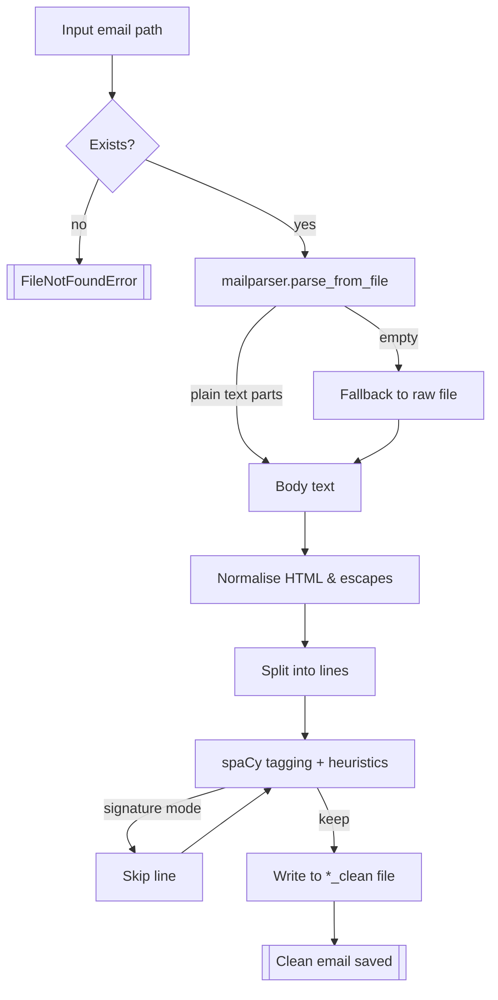

# EmailParser

EmailParser cleans plaintext emails by stripping out signature blocks and other contact-card clutter while keeping the conversational content intact. The heart of the project is the `convert` helper in `Parser.py`, which takes the path to an email file, scores each line, and writes a sibling `*_clean` copy with signatures removed.

## How it works

- The original email is parsed with [mailparser](https://github.com/SpamScope/mail-parser) so both MIME messages and simple text files are supported.
- Any HTML fragments are normalised into text, quotes are preserved, and the body is split into line-sized "sentences" for scoring.
- spaCy provides part-of-speech tags that help decide whether a short line is more like a salutation or contact info than real prose.
- Heuristics catch common signature openings (for example, “Best,” or “Sent from my iPhone”) and contact-card patterns such as phone numbers, email addresses, and pipe-separated title lines.
- When the signature boundary is detected, lines are skipped until the parser encounters either a quoted message delimiter or a new conversational fragment.

The result is a text file with the same structure as the original message but without the trailing signature block. Quoted threads, forward headers, and empty lines are preserved as-is.

### Processing flow

1. **Load email** — `convert(path)` resolves the file, ensures it exists, and prepares the sibling `*_clean` output path.
2. **Extract body with mailparser** — `mailparser.parse_from_file` walks the MIME structure and returns plain-text parts; if none are found, the raw file contents become the fallback body.
3. **Normalise text** — HTML fragments are flattened to UTF-8 text, escape sequences are unescaped, and windows-style line endings collapse to Unix `\n`.
4. **Split into candidate lines** — the body is split with `splitlines(keepends=True)` so each original line (including blanks) can be evaluated independently.
5. **Score each line** — spaCy tags the short lines; heuristics look for signature cues (closings, contact data, headers, quote delimiters) and toggle a “signature mode.” Probability thresholds decide if borderline lines are dropped.
6. **Write cleaned copy** — when outside signature mode, lines are streamed to disk verbatim; once a signature is detected it’s skipped until a new conversational block or quoted thread appears.



## Setup

Create a virtual environment, install dependencies, and download the spaCy English model:

```bash
python3 -m venv venv
source venv/bin/activate
pip install -r requirements.txt
python -m spacy download en_core_web_sm
```

For convenience you can run the bundled helper script, which activates the checked-in environment (if present), ensures `numpy`, `spacy`, and `en_core_web_sm` are installed, and prints the paths in use:

```bash
source activate_env.sh
```

## Usage

Run the parser against any text-based email file. The command below prints the path of the cleaned output:

```bash
python -c "from Parser import convert; print(convert('emails/test0.txt'))"
```

Key behaviour:

- A new file named `<original>_clean.txt` is written in the same directory as the input.
- Existing files are overwritten so that re-running the parser updates the cleaned copy.
- The optional `threshold` argument in `convert` (default `0.9`) controls how aggressively short lines are treated as signatures. Lower values keep more borderline lines.
- To force a different spaCy model, pass `model='en_core_web_md'` or another installed pipeline.

To tidy up generated artefacts after experimenting:

```bash
rm emails/*_clean.txt
```

## Extras

- `Example.ipynb` illustrates the parsing pipeline and lets you compare raw vs. cleaned output inside a notebook.
- The `emails/` folder contains anonymised sample messages that double as regression fixtures; feel free to drop in your own `.txt` files for quick testing.

## Troubleshooting

- If you see `OSError: [E050]` from spaCy, the requested model is missing—re-run `python -m spacy download en_core_web_sm`.
- MIME emails with attachments may produce blank bodies if `mailparser` cannot decode the payload. In that case the raw file contents are used as a fallback.
- For HTML-heavy messages, ensure they are saved with UTF-8 encoding so the parser can safely normalise line endings.

## Preparing input emails

If you are starting from scratch, create the folder structure and seed email file before running `convert`:

```bash
mkdir -p emails
cat <<'EOF' > emails/test0.txt
Hi there,

This is a placeholder message so you can test EmailParser.

Best,
Signature Bot
Signature Bot | Example Org
555-0100 | bot@example.org
EOF
```

- `mkdir -p emails` ensures the `emails/` directory exists (the `-p` flag keeps the command idempotent).
- The here-document writes a minimal message that includes a short body plus a signature block for the parser to remove.
- Feel free to replace the contents of `test0.txt` with any plain-text email. Additional files can be added alongside it (`emails/my_message.txt`) and will be cleaned to `emails/my_message_clean.txt`.